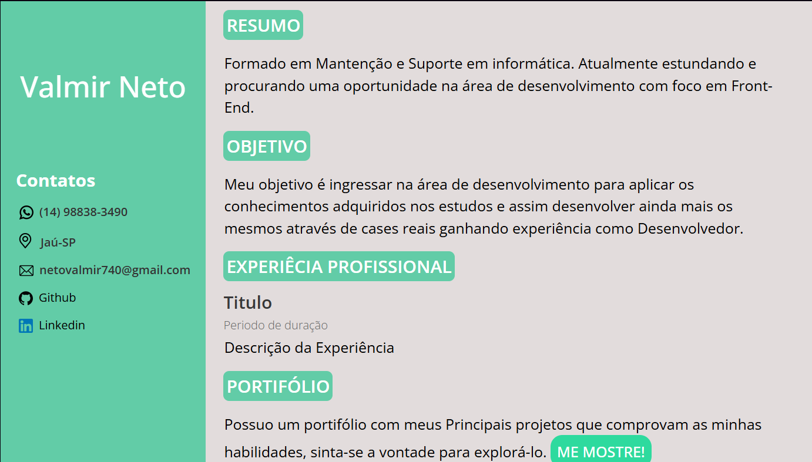
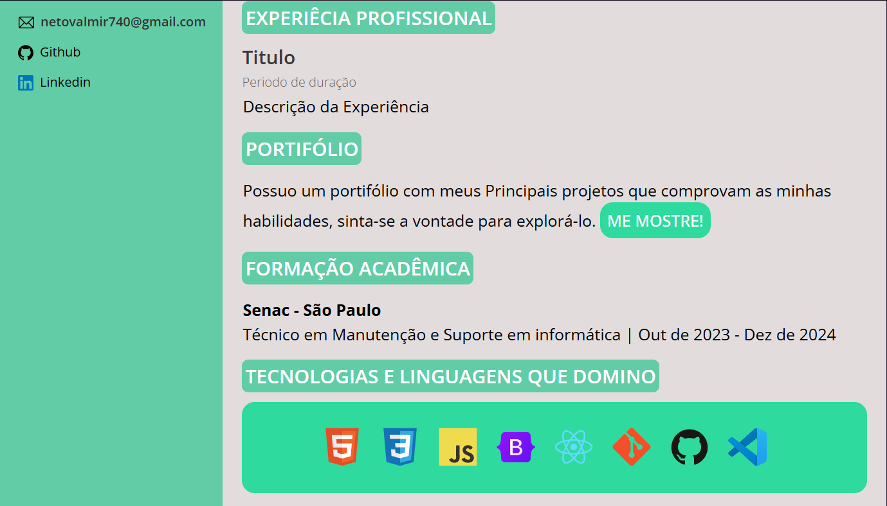

# Projeto "Meu curriculum de Desenvolvedor Front - End"
## Objetivo ✔

> O objetivo deste projeto é desenvolver um curriculum em formato de uma Web Page para demonstrar minhas habilidades logo de início e surpreender os recrutadores que não estejam acostumados com a adoção deste método para distribuição do mesmo.
___
## Descrição 📝

> O projeto consiste em uma página web que contem minhas informações para contanto e localização atual na esquerda e o desenvolvimento do curriculum em si na direita. O documento contém um resumo, sobre minha carreira acadêmica e atual objetivo profissional, meu objetivo com este curriculo, Minhas experiêcias profissionais que pretendo preecher quando tiver a oportunidade de desenvolver um projeto relevante profissionalmente, um link para o meu portifólio, minhas formações e as linguagens e tecnológias que domino atualmente.
---
## Imagens do Projeto 📁
### Imagem 1 📌

### Imagem 2 📌

---

# **Atenção** ⚠
A inspiração do Layout foi retirado de uma documento do canva pertencente a escola DNC. Deixo aqui os meu creditos ao autor. E caso queira fazer uso do projeto para melhorar ou adaptar para você, sinta-se a vontade para tal. 
